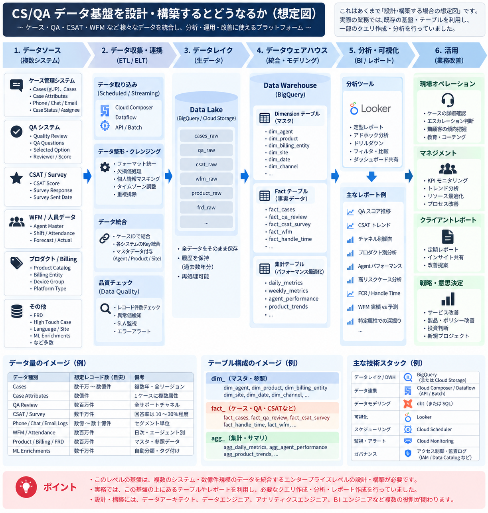

# CS/QAデータ基盤の構造とローカル再現コード

2024年12月に再編したCS/QAデータ基盤の構造と、合成データでローカル実行する再現用コードを記録するリポジトリです。
**2024年12月は構造の再編時点です。現行コードを当時の実装や本番コードとして扱いません。**
実データ・秘密情報は掲載せず、実行には合成ケースデータを使用します。

## 2024年12月の再編構造



画像は「設計・構築する場合の想定図」です。画像の注記のとおり、実務では既存の基盤・テーブルを利用し、
一部のクエリ作成・分析・レポート作成を担当しました。基盤全体の設計・構築を担当したという記録ではありません。
画像の件数・回答率は想定例であり、実測値ではありません。

| 段階 | 役割 |
|---|---|
| 1. データソース | ケース、QA、CSAT、WFM、人員、Product/Billing等の業務データ |
| 2. 収集・連携 | 取り込み、整形、キー統合、品質チェック |
| 3. データレイク | rawデータと履歴を保持し、再処理に備える |
| 4. DWH | dimension / fact / 集計テーブルで分析用に整理 |
| 5. 分析・可視化 | 指標計算、定型レポート、アドホック分析 |
| 6. 活用 | 現場対応、教育、KPI管理、顧客報告、サービス改善 |

BigQuery、Cloud Storage、Looker、Cloud Composer、Dataflow等は画像にある参照技術です。
現行コードはこれらに接続せず、GCPの認証・リソース作成・デプロイも行いません。
詳細は[再編構造と設計補足](docs/reorganization-2024-12.md)に記載しています。

## 現在のコードとの対応

| ファイル | 入力 | 主な処理 | 出力 |
|---|---|---|---|
| [`src/generate_data.py`](src/generate_data.py) | 件数・seed（既定200件・42） | Fakerと乱数でケース生成 | `data/synthetic/cases.csv` |
| [`src/extract.py`](src/extract.py) | 合成ケースCSV | 必須14列の存在確認、日付読み込み | DataFrame |
| [`src/transform.py`](src/transform.py) | DataFrame・必須環境変数 | 3列の仮名化、欠損・範囲チェック | 変換済みDataFrame、品質レポート |
| [`src/quality_gate.py`](src/quality_gate.py) | 品質レポート・[`rules/quality_gate.yaml`](rules/quality_gate.yaml) | チェック別の許容違反件数と比較 | 違反一覧（runnerが後続処理を停止） |
| [`src/load.py`](src/load.py) | 変換済みDataFrame | SQLiteの`cases`テーブルを置換 | `data/warehouse.db` |
| [`src/analytics.py`](src/analytics.py) | SQLiteの`cases` | 全体・カテゴリ・購入元・週別集計 | 4種類の集計DataFrame |
| [`src/dashboard.py`](src/dashboard.py) | 集計DataFrame | 静的HTMLとセクション付きCSVを作成 | `output/dashboard.html`、`output/kpi_summary.csv` |
| [`pipeline/run_pipeline.py`](pipeline/run_pipeline.py) | 固定の入出力パスと品質設定 | 抽出→変換→品質ゲート→保存→分析→表示の順に実行 | 成果物、ログ、終了コード0/1/2 |

データ生成はrunnerの前に別途実行します。処理の詳細は[ローカル実装の設計](docs/architecture.md)を参照してください。

## 実装範囲

実装済みの範囲は次のとおりです。

- 入力：顧客情報、ケース属性、`qa_score`、`agent_id`等を含む単一の合成ケースCSV。
- 変換：氏名・メールのローカル部のHMAC-SHA256、電話番号の末尾4桁以外のマスク。
- 品質：各列の欠損件数、`resolution_time >= 1`、`qa_score`の1〜5判定、仮名化前後のユニーク数。既定では欠損・範囲違反が1件でもあれば保存前に停止。
- 保存：ローカルSQLiteの単一`cases`テーブル。追記・履歴保持はせず毎回置換。
- 指標：ケース件数、`resolution_time`の平均（出力名はAHT）、T2/T3の割合、60分以内の割合（SLA）、平均QA値、症状カテゴリ別件数、購入元別件数、週別件数。
- 成果物：SQLite、品質CSV、KPIのHTML/CSV。品質CSVは`output/quality_report.csv`に保存。

QA・CSAT・WFM・人員・Product/Billingの独立した取り込み、複数ソース結合、raw履歴管理、dim/fact/agg構造、
CSAT/FCR/WFM分析、チャネル・製品・Agent別分析、クラウド連携は未実装です。
[`rules/classification.yaml`](rules/classification.yaml)は配置されていますが、コードから読み込まれず、分類・エスカレーション判定には使われません。
欠損補完、重複排除、タイムゾーン統一も未実装です。

仮名化は匿名化ではありません。電話の末尾4桁・メールのドメインは残り、自由記述や追加列は変換対象外です。
合成入力CSV自体は仮名化前の値で保存されます。指標は合成データによる例示で、本番の実績・契約上の定義ではありません。

## 実行方法

Python **3.11以上**を使用してください（既存CIは3.11）。依存関係は[`requirements.txt`](requirements.txt)の
pandas、PyYAML、pytest、Fakerです。SQLiteはPython標準ライブラリを使用します。
以下はリポジトリのルートで実行します。

```bash
python3.11 -m venv .venv
source .venv/bin/activate
python -m pip install -r requirements.txt
make seed PYTHON=python
```

実行前に環境変数 **`BPO_PII_HMAC_KEY`** を実行環境側で設定してください。
未設定・空文字・空白のみの値は、有効な氏名・メールを変換する際にエラーになります。
実際の値は資料やGitに記録しません。`.env`を自動で読む機能はありません。

```bash
make run PYTHON=python
make test PYTHON=python
```

終了コードを直接確認する場合は`python -m pipeline.run_pipeline`を使用します。
0は成功、1は処理例外、2は品質ゲート違反です。`make`の終了コードはPythonの値と一致しない場合があります。
テストでは既存fixtureがテスト専用値を設定します。

| 出力先 | 内容 |
|---|---|
| `data/synthetic/cases.csv` | 既定200件の合成入力。日付は2026-06-24を基準とする生成値 |
| `data/warehouse.db` | 仮名化後の`cases`テーブル |
| `output/quality_report.csv` | 欠損・範囲違反件数と仮名化前後のユニーク数（欠損率・型違反一覧ではない） |
| `output/dashboard.html` | 4種類の集計表を表示する静的HTML |
| `output/kpi_summary.csv` | `# summary`等の見出しを含む4表のCSV（単一の矩形テーブルではない） |

これらは生成物としてGit管理対象外です。再実行で上書きされますが、失敗時に前回のDB・HTML・KPI CSVを削除する処理はありません。
`make clean`は合成CSV、DB、`output/`のHTML/CSVを削除するため、不要になった生成物に対してのみ実行してください。

## 構成バリエーション

| 資料 | 時点・位置づけ |
|---|---|
| [GCP版：再編構造・設計補足](docs/reorganization-2024-12.md) | 2024年12月に整理した構造の参照資料 |
| [AWS版：派生構成案](docs/architecture-aws.md) | 同じ6段階をAWSサービスで表現した案。作成時点は2026年10月 |
| [現行ローカル実装](docs/architecture.md) | 現在動作する合成データ用のPython・SQLite実装 |

AWS版は当時の実装・本番構築実績・検証済みの稼働構成を示しません。図と詳細は各設計資料に記載しています。
