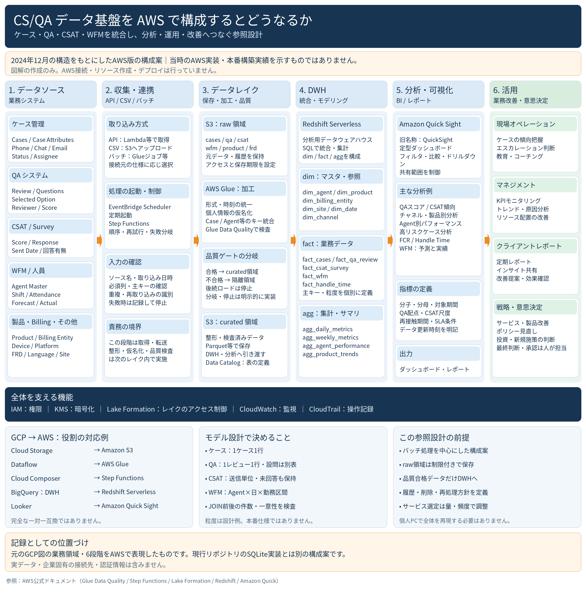

# CS/QAデータ基盤のAWS派生構成案

## 時点と位置づけ

**作成時点：2026年10月。** [GCP版](reorganization-2024-12.md)で2024年12月に整理した業務領域と6段階の構造を、
AWSサービスで表現した派生構成案です。2024年当時のAWS実装、本番構築実績、検証済みの稼働構成を示すものではありません。

元のGCP画像にある実務担当範囲の注記を引き継ぎます。実務では既存の基盤・テーブルを利用し、
一部のクエリ作成・分析・レポート作成を担当しました。基盤全体を設計・構築したという記録ではありません。

[現行ローカル版](architecture.md)は合成データ用のPython・SQLite実装で、このAWS構成とは別です。
この資料と画像の追加に伴うAWS・GCPへの接続、認証、リソース作成、デプロイは行っていません。
クラウド環境や大規模基盤を個人PCで再現する手順は、この記録の対象外です。

## 参照画像

提供された`CS_QA_AWS_Architecture.png`を加工せず保存しています。

以下では、画像にある構成と設計上の補足を区別します。画像の粒度は設計例であり、本番仕様ではありません。
非公開の過去構成、関係企業、実データ、企業固有の接続先は記載しません。

## 6段階の役割

| 段階 | 画像にある構成・役割 |
|---|---|
| 1. データソース | ケース・属性・Phone/Chat/Email・担当者、QAレビュー・設問、CSAT送信・回答、WFM予測・実績・勤務、人員、製品・Billing・その他 |
| 2. 収集・連携 | APIはLambda等、CSVはS3へのアップロード、バッチはGlueジョブ等で取得・転送。ソース名・取り込み日時、必須列・主キー、重複・再取り込みを確認。Schedulerで起動し、Step Functionsで順序・再試行・失敗分岐を制御する案 |
| 3. データレイク | S3のrawに元データ・履歴を保持し、Glueで形式・時刻・キーの統一と仮名化、品質検査を行う。合格データをcurated、不合格データを隔離領域へ分岐 |
| 4. DWH | Redshift Serverlessで分析用に統合・集計し、dim / fact / aggを構成する案 |
| 5. 分析・可視化 | Amazon Quick Sightで定型ダッシュボード、比較、ドリルダウン、レポート共有。QA・CSAT・チャネル・製品・Agent・FCR・Handle Time・WFM等を分析対象とする案 |
| 6. 活用 | 現場対応・教育、KPI管理・配置改善、顧客報告、サービス改善・意思決定。最終判断・承認は人が担当 |

バッチ中心の案です。第2段階の取得・転送と、第3段階の整形・仮名化・品質検査を分けています。
接続方式はソースの仕様に応じて選ぶ想定で、実際の接続先・更新頻度・データ量は未定義です。
FRDの意味・具体的な項目は資料に記載なしです。

## AWSサービスの役割

各サービスを置くだけで図全体が動作するわけではありません。下表は図で割り当てた役割であり、設定済みの構成ではありません。
サービスの一般的な役割は、リンク先のAWS公式資料で確認しています。

| サービス | この構成案での役割 |
|---|---|
| [Amazon S3](https://docs.aws.amazon.com/AmazonS3/latest/userguide/Welcome.html) | raw・curatedの保存先。rawはアクセスと保存期限を制限し、curatedは整形・検査済みデータをParquet等で保存する想定 |
| [AWS Glue / Data Catalog](https://docs.aws.amazon.com/glue/latest/dg/what-is-glue.html) | Glueは加工処理、Data Catalogは表・スキーマ等のメタデータ管理。Catalog自体をデータ本体の保存先とはしない |
| [AWS Glue Data Quality](https://docs.aws.amazon.com/glue/latest/dg/glue-data-quality.html) | ルールによる品質評価。合否に応じた隔離・停止・ロード可否の制御は別途明示する |
| AWS Lambda | ソースAPIから取得する処理の候補。取得量・処理時間等に応じた適否は未検証 |
| [EventBridge Scheduler](https://docs.aws.amazon.com/scheduler/latest/UserGuide/what-is-scheduler.html) | 処理を定期起動する役割。頻度・時刻・タイムゾーンは未定義 |
| [AWS Step Functions](https://docs.aws.amazon.com/step-functions/latest/dg/welcome.html) | 複数処理の順序、分岐、再試行、失敗時の制御。品質結果を受けて後続処理へ進むか判断する案 |
| [Amazon Redshift Serverless](https://docs.aws.amazon.com/redshift/latest/mgmt/serverless-whatis.html) | SQLによる分析用DWH。dim / fact / aggの設計とロード処理は別途必要 |
| [Amazon Quick Sight](https://docs.aws.amazon.com/quick/latest/userguide/what-is.html) | BI・ダッシュボード・共有の役割。名称は提供画像の表記に合わせ、図にある「旧名称：QuickSight」も原本のまま保持 |
| [AWS Lake Formation](https://docs.aws.amazon.com/lake-formation/latest/dg/what-is-lake-formation.html) | レイクのデータアクセス制御。適用対象と権限設計を定める必要がある |

画像には、全体を支える機能としてIAM（権限）、KMS（暗号化）、CloudWatch（監視）、CloudTrail（操作記録）もあります。
具体的な権限、暗号化設定、監視項目、記録対象、保持期間は未定義であり、設定・動作確認済みという意味ではありません。

## GCP版との役割の対応

**完全な一対一互換ではありません。** 同じ業務上の役割を表すための対応で、API・SQL・権限・運用・性能・費用の互換性を保証しません。

| 役割 | GCP参照図 | AWS派生図 | 読み替えの注意点 |
|---|---|---|---|
| データレイクの保存 | Cloud Storage / BigQueryのraw領域 | S3 raw / curated | AWS案ではオブジェクト保存とDWHを分ける。保持・再処理方式まで同一ではない |
| 加工・データ統合 | Dataflow | AWS Glue | 同じジョブをそのまま移せる意味ではない。AWS図はバッチ中心の案 |
| 処理の制御 | Cloud Composer | Step Functions | どちらも順序制御の役割を担う候補だが、ワークフロー定義や実行方式は異なる |
| 定期起動 | Cloud Scheduler | EventBridge Scheduler | 起動頻度・失敗時の扱い・重複実行への対応は別途設計 |
| DWH | BigQuery | Redshift Serverless | dim / fact / aggという論理構造の対応。SQL・ロード・物理設計の互換性は別問題 |
| 可視化 | Looker | Amazon Quick Sight | ダッシュボードや指標定義をそのまま移行できる意味ではない |
| モデリング | dbt / SQL | RedshiftでのSQL統合・集計 | AWS図はdbt採用を明記していない |
| カタログ・権限 | IAM / Data Catalog等 | IAM / Glue Data Catalog / Lake Formation | メタデータ管理とデータアクセス制御を分けて考える。権限モデルの直接変換ではない |
| 監視・記録 | Cloud Monitoring、監査ログの概念 | CloudWatch / CloudTrail | 監視と操作記録を区別。対象や保持期間は未定義 |

元のGCP図では収集・連携段階に整形・マスキング・品質チェックを含めています。
AWS図ではそれらをレイク内のGlue処理と品質ゲートとして表現しています。この責務の配置差も、単純なサービス名の置換ではない点です。

## 品質ゲートと隔離領域

画像にある流れは、**S3 raw → Glue加工・品質評価 → 合格ならcurated → DWH**です。
不合格は隔離領域へ送り、後続ロードを停止する案です。rawには仮名化前のデータが存在し得るため、
「保存前にすべて仮名化する」構成とは区別します。

Glue Data Qualityは品質を評価する機能です。隔離先への書き出し、結果に応じた分岐、後続ロードの停止は、
ジョブやワークフローに明示的に実装する必要があります。本リポジトリにそのクラウド実装はありません。
ETLジョブでは不合格行の識別を利用できますが、すべての品質ルールが行単位の判定になるわけではありません。
[公式資料：Glue Data Qualityの評価方式](https://docs.aws.amazon.com/glue/latest/dg/glue-data-quality.html)

以下は図を補う設計上の注意点で、本番仕様ではありません。

- 入力の必須列・主キー、欠損・範囲・一意性・参照整合性などの検査項目と許容閾値を、領域ごとに定義する。AWS案の具体的なルール・閾値は未定義。
- 行単位で隔離するか、ファイル・バッチ全体を不合格にするかは未定義。部分合格データだけを公開してよい条件も定義が必要。
- 隔離領域の具体的な保存先・バケット構成は図に記載なし。raw・curated・隔離を区別するだけで権限制御が成立するわけではない。
- 隔離したデータには入力元・取り込み単位・失敗理由を関連付け、修正後も再評価を通してから公開する。記録形式、保持・削除期限、再処理の承認手順は未定義。
- 再取り込み・再試行でケースや集計値を重複させない識別方法と、公開単位を定める。停止時に前回の成果物が残る場合は、最終成功時刻と更新対象期間を区別する。

## テーブル候補、粒度と結合

以下は画像に記載された候補です。DDL、具体的な主キー列、外部キー、履歴管理方式は未定義です。

| 区分 | 画像の候補 |
|---|---|
| dim | `dim_agent`、`dim_product`、`dim_billing_entity`、`dim_site`、`dim_date`、`dim_channel` |
| fact | `fact_cases`、`fact_qa_review`、`fact_csat_survey`、`fact_wfm`、`fact_handle_time` |
| agg | `agg_daily_metrics`、`agg_weekly_metrics`、`agg_agent_performance`、`agg_product_trends` |

画像の粒度例は、ケース1件1行、QAレビュー1件1行（設問は別表）、CSAT送信単位（未回答も保持）、
WFMはAgent×日×勤務区間です。`fact_handle_time`の測定単位、予測WFMと実績WFMの対応、各aggの集計軸は未定義です。

設計補足として、ケースに複数のQAレビューとCSAT送信が対応する場合、それらを直接JOINすると件数が増幅します。
例えばレビュー2件と送信3件は6行になり得ます。必要な粒度へ先に集計する等の方針を定め、
JOIN前後の件数・キー一意性・未結合率・指標の分母を確認する必要があります。この例は本番データの実測ではありません。

ソース間のID衝突、Agent所属や製品属性の変更履歴、業務日・時刻の扱いも設計対象です。
QA配点、CSAT尺度、FCRの再接触期間、Handle Timeの内訳、SLA条件、対象期間、更新時刻を明示しない限り、
同名の指標を同じ意味として比較できません。具体的な本番定義は資料に記載なしです。
共通の注意点は[GCP版の設計補足](reorganization-2024-12.md)も参照してください。

## 現行Python・SQLite実装との違い

| 観点 | AWS派生構成案 | 現行ローカル実装 |
|---|---|---|
| 入力 | 複数領域のAPI・CSV・バッチ | 単一の合成ケースCSV。QA値はケース内の列で、独立入力ではない |
| 制御 | Scheduler / Step Functions | 手動実行の線形Python runner。再試行や分岐ワークフローは未実装 |
| 保存・加工 | S3 raw / Glue / curated | 合成CSVを読み、メモリ上で仮名化・品質チェック。クラウドレイクは未実装 |
| 品質 | Glue Data Qualityと明示的な隔離・停止分岐 | `src/quality_gate.py`とYAMLの閾値判定。品質違反でrunnerは終了コード2を返し、Loadをスキップ。隔離領域への保存は未実装 |
| DWH | Redshift Serverlessのdim / fact / agg | `src/load.py`でSQLiteの単一`cases`を置換。テーブル間JOIN・履歴保持なし |
| 分析・出力 | 複数領域の指標とQuick Sight | ケース件数、時間・QAの平均、エスカレーション・SLAの割合、カテゴリ・購入元・週別件数を静的HTML/CSVへ出力 |
| 運用 | 権限、監視、操作記録、保持・再処理方針を設計 | ローカルのログ・品質CSV・終了コード。クラウド運用機能は未実装 |

ローカル実装は品質ゲート違反時にも前回のDB・HTML・KPI CSVを削除しません。
また、AWSの品質ルールが既存YAMLから自動生成される仕組みや、SQLiteからRedshiftへの接続・移行処理はありません。
本資料の追加で実行範囲は変わりません。実行方法と制約は[README](../README.md)および[ローカル実装の設計](architecture.md)を参照してください。
