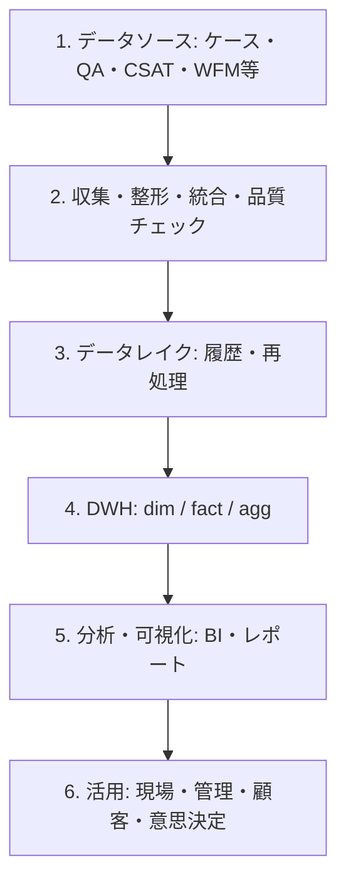

# 2024年12月の再編構造 — CS/QA データ基盤の参照設計

## 資料の位置づけ

- 構造の再編時点：2024年12月。画像内には年月の記載はなく、この日付は現行コードの実装時点を示しません。
- 出典：[ユーザー提供の想定図](assets/cs-qa-architecture-2024-12.png)。画像は原本のまま収録しています。
- 図の対象：ケース・QA・CSAT・WFM等を統合して、分析・運用・改善に使うプラットフォームの構想。
- 実務範囲：画像の注記では、既存の基盤・テーブルを利用し、一部のクエリ作成・分析を担当しています。
- リポジトリ：合成データを使った自作のローカルETLデモです。2024年当時の本番コードや実データの復元ではありません。

以下の粒度・結合注意点は設計補足であり、実際の本番仕様ではありません。画像の想定件数・回答率は例示で、実測値ではありません。本番の件数・更新頻度・保存期間・SLA条件は資料に記載なし。

## 6段階の構造

| 段階 | 図の構想 | 現在のコードとの対応 |
|---|---|---|
| 1. データソース | ケース、QA、CSAT、WFM、人員、製品、Billing、その他 | `src/generate_data.py` の合成ケースCSVのみ。独立したQA/CSAT/WFM等の入力は未実装 |
| 2. 収集・連携 | Scheduled/Streaming、API/Batch、整形、欠損処理、マスキング、時刻調整、重複排除、キー結合、品質チェック | `src/extract.py`、`src/transform.py`、`src/quality_gate.py`。複数ソース結合・ストリーミング等の全機能を実装した意味ではない |
| 3. データレイク | raw領域、履歴保存、再処理 | 専用レイク・履歴管理は未実装。合成CSVはローカル入力ファイル |
| 4. DWH | dimension、fact、集計テーブル | `src/load.py` がSQLiteの単一 `cases` テーブルを置換。dim/fact/agg構造は参照設計 |
| 5. 分析・可視化 | QA、CSAT、チャネル、製品、Agent、高リスク、FCR、Handle Time、WFM | `src/analytics.py` と `src/dashboard.py` による限定的なKPI、HTML/CSV。CSAT/FCR/WFMなどは未実装 |
| 6. 活用 | 現場対応、教育、KPI管理、資源最適化、顧客報告、サービス改善 | レポート出力まで。現場判断・承認・施策実行は自動化していない |

## データ領域と参照テーブル

| 領域 | 図に記載された要素 | raw領域の例 | fact候補・粒度（設計補足） |
|---|---|---|---|
| ケース | Cases、属性、Phone/Chat/Email、Status、Assignee | `cases_raw` | `fact_cases`: ケース1件。接触履歴は別表で1接触1行にする |
| QA | Quality Review、Questions、Selected Option、Reviewer/Score | `qa_raw` | `fact_qa_review`: レビュー1件。設問回答は別表で1レビュー×1設問 |
| CSAT / Survey | Score、Response、Sent Date | `csat_raw` | `fact_csat_survey`: 送信1件。未回答も保持し回答率の分母に含める |
| WFM / 人員 | Agent Master、Shift/Attendance、Forecast/Actual | `wfm_raw` | `fact_wfm`: Agent×日×勤務区間。予測はSite×Channel×時間帯など別粒度で管理 |
| Product / Billing | Product Catalog、Billing Entity、Device Group、Platform Type | `product_raw` | 主に `dim_product` / `dim_billing_entity` の参照データ。請求取引factは図に具体記載なし |
| その他 | FRD、High Touch Case、Language/Site、ML Enrichments | `frd_raw`、追加領域 | FRDの意味・キーは資料に記載なし。追加属性や分類結果の粒度を別途定義 |

共通dimension候補は `dim_agent`、`dim_product`、`dim_billing_entity`、`dim_site`、`dim_date`、
`dim_channel`。図の `fact_handle_time` は、実装時には接触1件など測定単位を確定してから作成します。

集計領域は画像内で `daily_metrics` / `weekly_metrics` / `agent_performance` / `product_trends` と、
`agg_daily_metrics` / `agg_agent_performance` / `agg_product_trends` の両表記があります。
命名の統一方針は未定義です。粒度・対象期間・更新時刻・指標の分子分母も資料に記載なし。

## 結合と指標の設計上の注意点

1. **結合キー**：ケースIDだけで全表を直接JOINしない。QAレビューやSurvey、接触履歴は1対多になる。
   ソースを識別するキーと各表の主キーを定義し、必要な粒度に集計してから結合する。
2. **水増し防止**：QAレビュー2件×Survey3件のJOINは6行になる。JOIN前後の件数、主キー一意性、
   未結合率を確認し、CSAT・QAの分母が増えないようにする。
3. **履歴**：AgentのSite/所属や製品属性が変わる場合、分析時点の属性を再現できる履歴方針を定義する。
   現在のSQLite置換ロードではこの履歴を保持しない。
4. **時刻**：元タイムゾーン、UTC時刻、レポート対象の業務日を区別する。WFM予測と実績は同じ時間帯・Site・Channelで比較する。
5. **QAとCSAT**：現行の `qa_score` は合成ケース内の1〜5の値で、設問別QAやCSATとは別。
   QAは配点・対象件数、CSATは尺度・回答件数・送信件数を定義してから比較する。
6. **AHT/FCR/SLA**：現行コードは `resolution_time` の平均をAHTとして出力するデモ。
   実務のAHTに必要な通話・保留・後処理時間や、FCRの再接触期間、SLAの契約条件を持つ実装ではない。
7. **rawとPII**：図の「全データをそのまま保存」は概念説明。実データを保管する場合はアクセス制御、
   保存期限、削除、監査、マスキングの境界を決める。現行デモは合成CSVを読み込み、仮名化と品質ゲートの後にDWHへ書き込む。

## 技術スタックの読み方

| 役割 | 図の技術例 | 本リポジトリの実行方式 |
|---|---|---|
| Lake / DWH | BigQuery / Cloud Storage | ローカルCSV / SQLite |
| 連携 | Cloud Composer / Dataflow / API / Batch | Pythonの線形runner |
| モデリング | dbt / SQL | Pandasによる変換。dbtモデルは未実装 |
| 可視化 | Looker | 静的HTML / CSV |
| スケジュール | Cloud Scheduler | 手動の `make seed` / `make run` |
| 監視 | Cloud Monitoring | 標準出力、品質レポート、終了コード |
| ガバナンス | IAM / Data Catalog等 | 必須HMACキー、仮名化、品質ゲート。クラウド権限制御は未実装 |

**GCP接続・認証・リソース作成・デプロイは追加していません。**
図のBigQuery、Looker等の名称は参照技術であり、動作確認済みのクラウド構成という意味ではありません。

## 図から確認できる関係と未定義事項

図には「ケースIDで結合」「各システムのKey統合」「Agent / Product / Siteのマスタ付与」とあります。
ただし、テーブル間の外部キー、カーディナリティ、主キー列、NULLの扱いは資料に記載なしです。
`dim_billing_entity` と `dim_product` の具体的な関連や、`fact_handle_time` とケースの対応も未定義です。
上記のfact粒度と1対多の例は設計検討用であり、画像で確定した関係ではありません。
現行実装にテーブル間JOINはありません。

現在の実行方法・成果物・制約は [README](../README.md) と [ローカル実装の設計](architecture.md) を参照してください。
